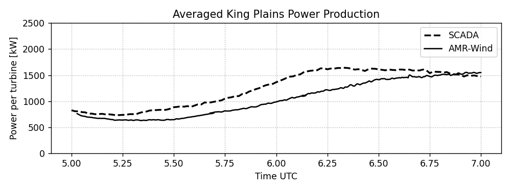

# AWAKEN benchmark results

## Lidar comparison

Comparison of site lidars is generated in [Compare_SiteLidar.ipynb](Compare_SiteLidar.ipynb).

### Site A1

### Site C1a

### Site A1

## Averaged power comparison

The comparison of the turbine power is shown in [Compare_Power_SCADA_AMRWind.ipynb](Compare_Power_SCADA_AMRWind.ipynb).

