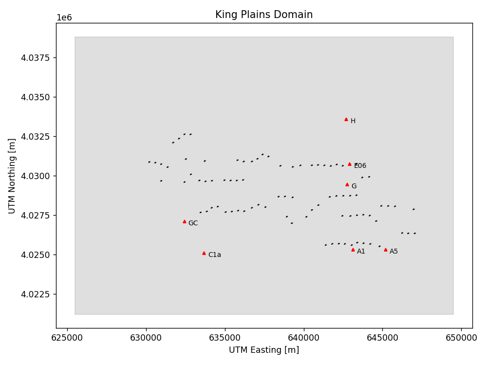
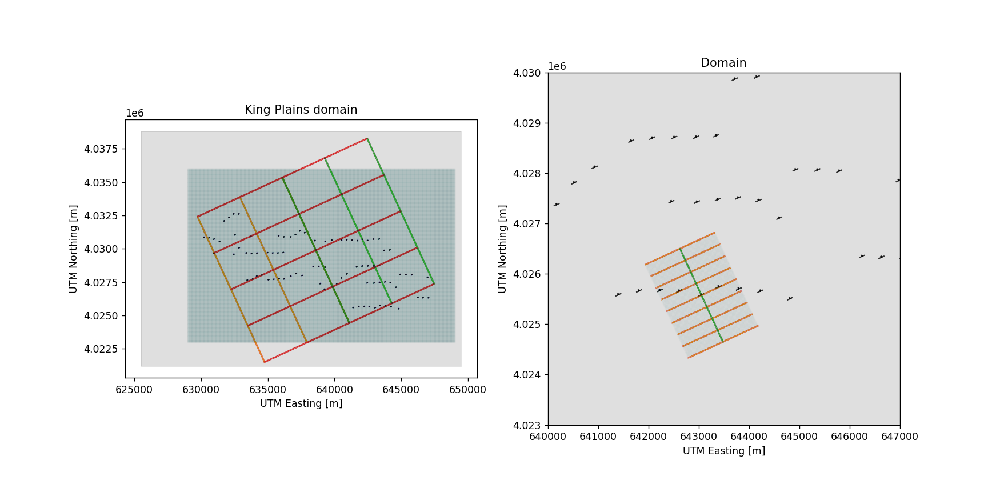

# Setting up the AWAKEN benchmark simulation in AMR-Wind

**Contents**

- [Prerequisites](#prerequisites)
- [Preparing the measurement data](#preparing-the-measurement-data)
- [Set up the ABL precursor run](#set-up-the-abl-precursor-run)
- [Compare statistics from the ABL precursor](#compare-statistics-from-the-abl-precursor)
- [Set up the wind farm run](#set-up-the-wind-farm-run)

## Prerequisites

The measured data from the AWAKEN benchmark problem should be downloaded and unpacked before running the ABL simulation.  Specifically required are the A1 profiling and scanning lidar data, and the site B ASSIST temperature profiles available at the pages: 

- https://awaken-benchmark.readthedocs.io/en/latest/phase1.html
- https://awaken-benchmark.readthedocs.io/en/latest/phase2.html

For later comparisons, the wind farm performance data can also be downloaded from
- https://awaken-benchmark.readthedocs.io/en/latest/phase3.html

From the downloaded zip files, extract these three netcdf files and put them in a separate directory (here called `Phase2_Data`):
```bash
Phase2_Data/A1_profiling_lidar_10min.nc
Phase2_Data/A1_scanning_lidar_10min.nc
Phase2_Data/B_ASSIST.nc
```

In addition, download the [AMR-Wind front end](https://github.com/Exawind/amr-wind-frontend) tool.

The AMR-Wind front end tool has useful utilities which can be used for setting up the OpenFAST turbine model and postprocessing results, and will be required in the set up steps below.  It is available on github and can be downloaded via

```bash
$ git clone --recursive git@github.com:Exawind/amr-wind-frontend.git AMRWINDFEDIR
```

where `AMRWINDFEDIR` is the location you'd like the tool to be located.  For the basic use of front end tool, the usual python 3 libraries (numpy, scipy, pandas, etc.) are required.

In later stages of the simulation set up process, the AMR-Wind front-end tool will need to access the appropriate turbine model.  To make sure everything is in the right location, copy the `OpenFAST_NREL2p8-127_AWAKEN` directory to the `AMRWINDFEDIR/turbines` directory.  Similarly copy the [`nrel2p8_127.yaml`](nrel2p8_127.yaml) file into the same `AMRWINDFEDIR/turbines` directory.  That will allow the front-end tool to recognize the turbine model and know where the turbine files are located.

## Preparing the measurement data

Once the netcdf files are downloaded and ready, we can create the MMC profiles necessary to drive the ABL precursor.  Use the [MMCprofiles_Ph3_try1.ipynb](MMCprofiles_Ph3_try1.ipynb) notebook for this purpose.

The purpose of this notebook is to extract the necessary velocity and temperature profiles from the measured data and format them appropriately for use by AMR-Wind.  A few items are worthy of pointing in this notebook.  First, in cell 2 of the notebook, it defines several times of importance:

```python
tstart  = np.datetime64('2023-08-24T03:00')
t_5AM  = np.datetime64('2023-08-24T05:00')
t_7AM  = np.datetime64('2023-08-24T07:00')
```

The first time, `tstart`, is the start time of the precursor (03:00 UTC on 8/24/2023).  It is a couple of hours ahead of the desired start time for the wind farm simulation (`t_5AM`) in order for the turbulence to spin up.  The stop for both the precursor and the wind farm simulation is given by `t_7AM`), so in total, there will be a 2 hour spin-up time followed by a 2 hour wind farm simulation period.  Only velocity and temperature profiles in this time window will be extracted.  The line 

```python
tdeltas = [0, 0.5, 1, 1.5, 2, 2.5, 3, 3.5, 4]
```

instructs the notebook to extract profiles every 30 minutes during that 4 hour window.


In cell 3, the profiling lidar, scanning lidar, and the ASSIST profiles are read in:
```python
# Open NetCDF files
ds_A1prof = xr.open_dataset('Phase2_Data/A1_profiling_lidar_10min.nc')
ds_A1scan = xr.open_dataset('Phase2_Data/A1_scanning_lidar_10min.nc')

# Open the NetCDF file
ds_temperature = xr.open_dataset('Phase2_Data/B_ASSIST.nc')
```

The rest of the notebook is devoted to extracting the appropriate profiles from the measured data, plotting them for visual inspection, and then saving the data.  At the end of the processing, the following data files are created:

```
A1prof_heights.dat
A1prof_times1.dat
A1prof_WD1.dat
A1prof_WS1.dat
A1scan_heights.dat
A1scan_times1.dat
A1scan_TKE1.dat
A1scan_WD1.dat
A1scan_WS1.dat
Bassist_heights.dat
Bassist_T1.dat
```


## Set up the ABL precursor run

Once the scanning, profiling, and ASSIST profiles are generated, the notebook [MMC_BM3_BigPrecursor.ipynb](MMC_BM3_BigPrecursor.ipynb) will use the profiles to create the MMC forcing profiles required by AMR-Wind and set up the precursor input files.

This work is divided into several stages.  First, the lidar and the scanning profiles at A1 are merged into a single set of smooth, continuous profiles:


Secondly, the ASSIST temperature profiles are converted to potential temperature profiles:


Afterwards, the precursor input files are constructed using the generated profiles.  In cell 17, the run directory is created (the `rundir` name is currently set to `MMC_BM3_BigPrecursor`):

```python
suffix      = 'BigPrecursor'
rundir      = 'MMC_BM3_'+suffix
ICfilename  = 'init.nc'
MMCfilename = 'MMC.nc'
amrfilename = 'abl_HPP_MMC.inp'
rho         = 1.103707

# Go to the run directory
if not os.path.exists(rundir):
    os.makedirs(rundir)
```

In cell 55, both the initial condition and the MMC forcing profiles are created and stored in the `ICfilename` and `MMCfilename` files:

```python
# Set the MMC inputs
zstr, Tstr = writeMMC.makeIC_fromMMC(case.getAMRWindInput('geometry.prob_lo'), 
                                     case.getAMRWindInput('geometry.prob_hi'), 
                                     case.getAMRWindInput('amr.n_cell'), 
                                     all_Ublend, all_Vblend, all_Tblend,
                                     ldr_time, all_heights, rundir+'/'+ICfilename, tstart, verbose=True)
writeMMC.makeMMCforcing(case.getAMRWindInput('geometry.prob_lo'), 
                        case.getAMRWindInput('geometry.prob_hi'), 
                        case.getAMRWindInput('amr.n_cell'), 
                        all_Ublend, all_Vblend, all_Tblend, fluxdat,
                        ldr_time, all_heights, rundir+'/'+MMCfilename)
```

In the last step, the input file for the precursor run is generated and written out:

```python
# Write the input file
print(case.writeAMRWindInput(rundir+'/'+amrfilename))
```

## Compare statistics from the ABL precursor

After the precursor is run, the horizontally averaged statistics of the ABL can be compared against the lidar measurements.   For this, use the notebook [MMC_BM3_BigPrecursor_ABLStats.ipynb](MMC_BM3_BigPrecursor_ABLStats.ipynb).

In this notebook, the horizontally averaged statistics from the AMR-Wind ABL statistics file are first time-averaged over the correct time periods to compare against the lidar data.  Make sure that this run location

```python
rundir = '/tscratch/lcheung/AWAKEN/Benchmark1/Phase3/MMC/MMC_BM3_BigPrecursor'
```

and this ABL statistics file are set correctly

```python
case.ABLpostpro_loadnetcdffile(rundir+'/post_processing/abl_statistics00000.nc')
```

After time-averaging, you should see that the horizontally averaged profiles matched the merged lidar profiles very well:


This is not a surprise, as the direct assimilation approach should enforce this in the LES simulation.  However, the resulting TKE is not constrained, and when compared against the scanning lidar 10 min averages, the results are quite comparable:


Note that this is a comparison of the _horizontally_-averaged TKE profiles across the entire computational domain against the single point measurement from the scanning lidar.  Later on in the wind farm simulation, we will compare the point TKE results against the scanning lidar measurements, which will be a more fair comparison.

## Set up the wind farm run

After the precursor ABL is run, we can use it to set up the wind farm run with all of the King Plains turbines in place.   The notebook [Prod1_Phase3.ipynb](Prod1_Phase3.ipynb) will generate the input files and set up the OpenFAST turbines based on the precursor ABL run.

A few parameters in the notebook may need to be changed depending on computational setup.   In cell 4, the run directory and the name of the wind farm input file is specified:

```python
inputfile = 'FarmRun3_01.inp'
rundir = 'BM3_FarmRunProd1_runA'
```

The location of the precursor directory and the precursor input file is specified in cell 6:

```python
precursordir  = '/tscratch/lcheung/AWAKEN/Benchmark1/Phase3/MMC/MMC_BM3_BigPrecursor'
precursorsetup= precursordir+'/abl_HPP_MMC.inp'
```

Once those things are specified, the notebook makes the necessary modifications to the boundary conditions and forcing terms to switch from a periodic precursor run to a wind farm run.  This occurs in cell 10:

```python
case.boundaryplane_restart(bndryfiles=bndryfiles, 
                           forcingdict=forcingdict, 
                           inflowplanes=inflowplanes, 
                           checkpointdir=chkdir,
                           autoset_BodyForcing=False,
                           autoset_MMCForcing=False,
                           autoset_MMCTendencyForcing=True,
                           autooutflow=False,
                           massinflowBC='mass_inflow_outflow',
                           verbose=True)
```

Note that this command creates the tendency forcing file `tendencyforcing.nc` which is used to drive the wind farm simulation.

In the remaining sections of the notebook, the King Plains turbines are situated in the same 24km x 17.6km x 0.8 km domain as the precusor.



Two additional levels of mesh refinement are included, so the 10m background resolution is refined to 2.5m around each turbine rotor.


Lastly, the sampling planes are added to the simulation, capturing both the wakes from the farm as whole and individual turbine wakes and inflow.



Note that in cell 36, the wind farm simulation inputs are validated 

```python
v=case.validate();
```

After running through a number of checks, you should see the final results of the validation, with no warnings or failures.

```
Results: 
 885 PASS
 0 SKIP
 0 FAIL
 0 WARN
```

In the final step, the input file for the simulation is written out, and is included in the github repo as [FarmRun3_01.inp](../input_files/FarmRun3_01.inp).
