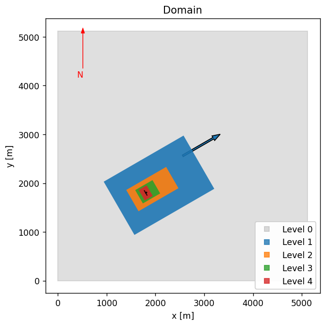

<!-- This file is automatically compiled into the website. Please copy linked files into .website_src/ paths to enable website rendering -->

# Actuator line NREL5MW in convectively unstable ABL 

This benchmark problem describes the simulation of a single NREL5MW turbine using an actuator line model in a turbulent, slightly convective unstable atmospheric boundary layer.

**Contents**

- [Simulation description and setup](#simulation-description-and-setup)
- [Postprocessing](#postprocessing)
- [Code performance](#code-performance)
- [Results](#results)

## Simulation description and setup

Full details provided in [**setup documentation**](setup/README.md).

The characteristics of the NREL5MW turbine used in this study are are defined in the technical report [NREL/TP-500-38060](https://www.nrel.gov/docs/fy09osti/38060.pdf).  The basic properties are included below

| Turbine property | Value |
| ---              | ---   |
| Rotor diameter   | 126 m |
| Hub-height       | 90 m  |
| Rated power      | 5 MW  |
| Rated wind speed  | 11.4 m/s |
| Rated rotor speed | 12.1 rpm |
| Cut in wind speed | 3 m/s |
| Cut out wind speed | 25 m/s |

An OpenFAST turbine model is used to represent the aerodynamic, structural, and turbine controller dynamics.  The [ROSCO controller](https://github.com/NREL/ROSCO) is used to govern the turbine operation.  The NREL5MW turbine is placed in a 5km x 5km x 2km domain with a total mesh size of 70.5 million elements.  The background mesh resolution is 10m, with two levels of refinement to reach 2.5m resolution at the rotor disk.  For the blade-resolved problem, an additional two levels of refinement is used in the AMR-Wind domain.

This atmospheric inflow for this case is generated via the [convectively unstable](../../atmospheric_boundary_layer/convective_abl_nrel5mw/) benchmark case.

## Code performance

Full details provided in [**performance documentation**](performance/README.md).

The job was run on an HPC cluster using 8 nodes/896 CPU's and run for 23.3 hours wall-time:

| Parameter       | Value |
|---              |---  |
| Number of nodes | 8   |
| Number of CPUs  | 896 |
| Wall-time       | 23.3 hours|
| CPU-hours       | 20862     | 

## Postprocessing

Full details provided in [**postprocessing documentation**](postprocessing/README.md).

A full set of postprocessing scripts is provided to extract results and images from the AMR-Wind simulations.  These scripts and notebooks will provide the ability to generate
- velocity contour visualizations
- turbine performance results
- blade loading profiles
- downstream wake profiles

## Results

Full details provided in [**results documentation**](results/README.md).

A description of the AMR-Wind results is included in the results documentation.  When appropriate, these will include comparisons against results from other codes and other simulation fidelities of the same NREL5MW turbine case.

