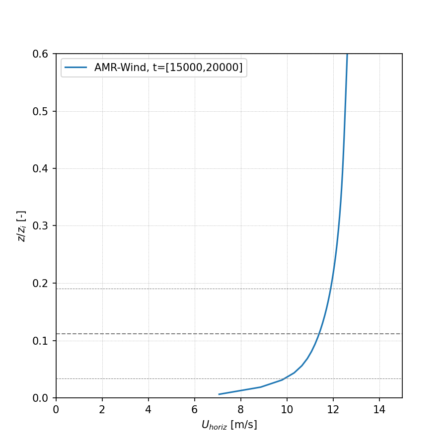
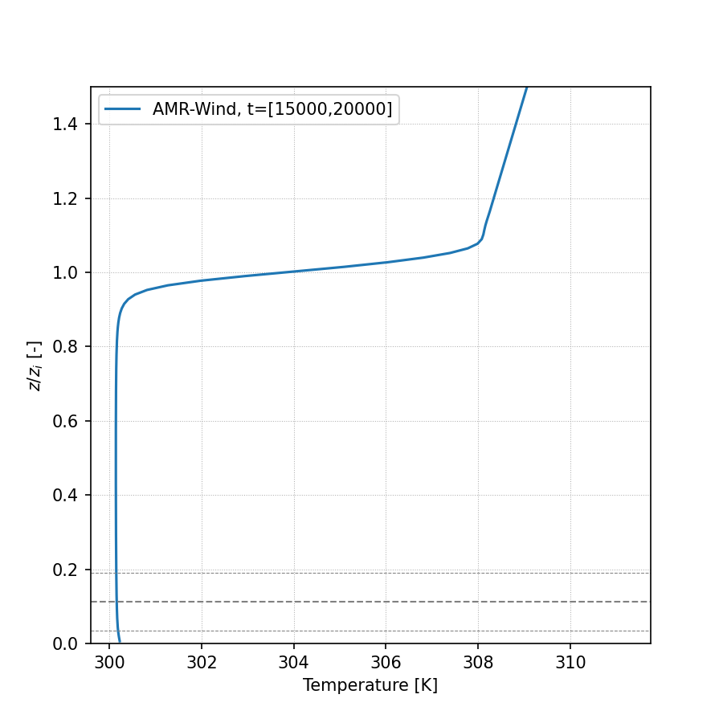
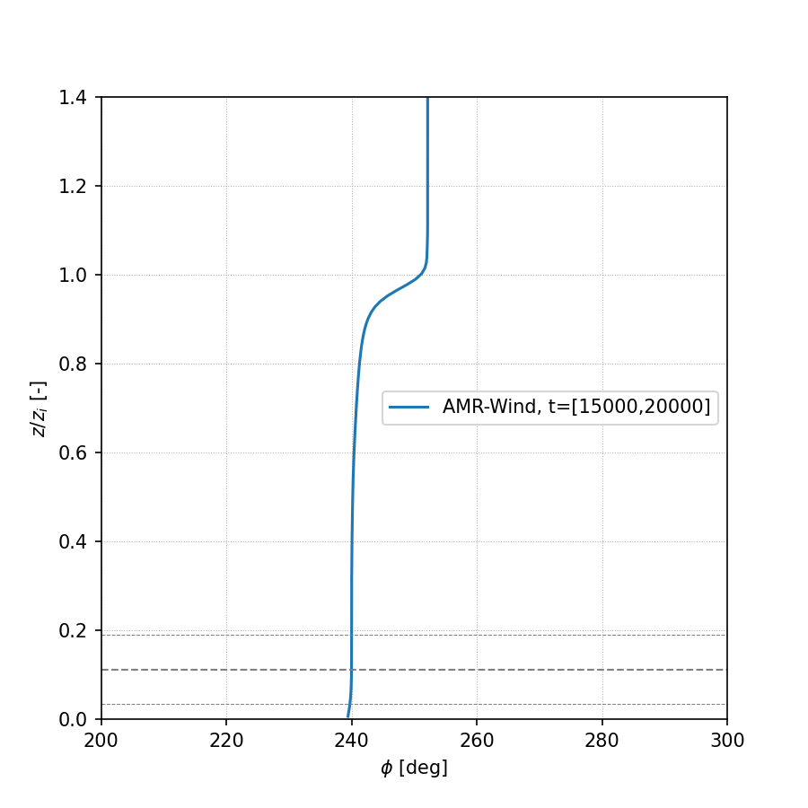
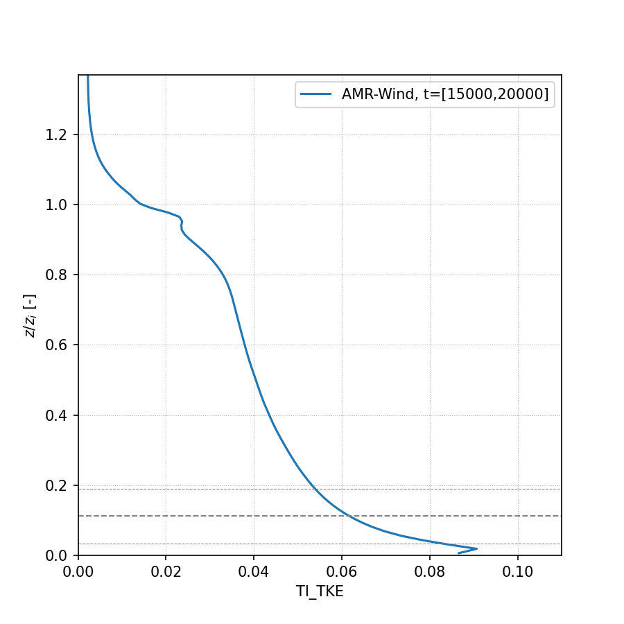
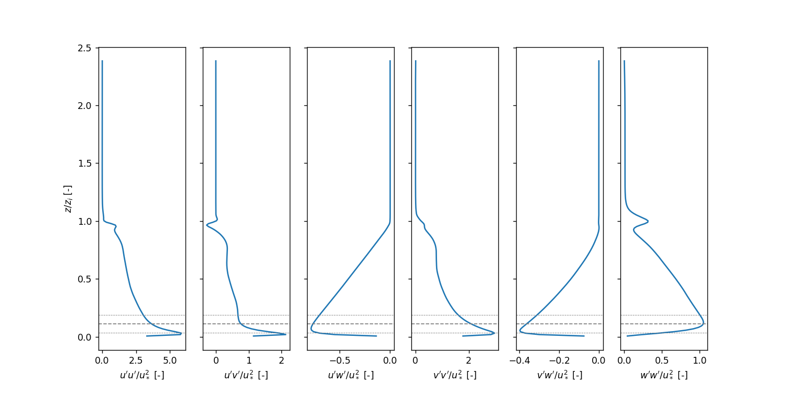
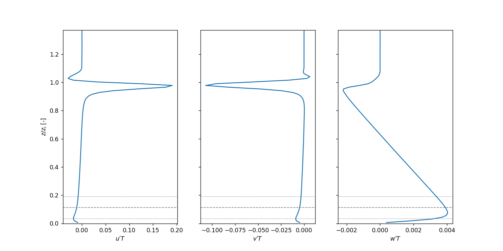
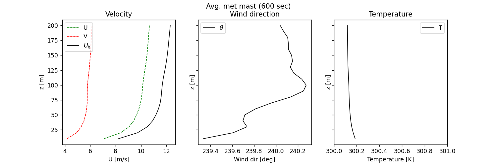
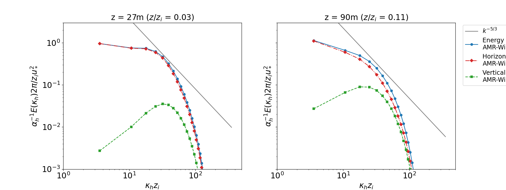
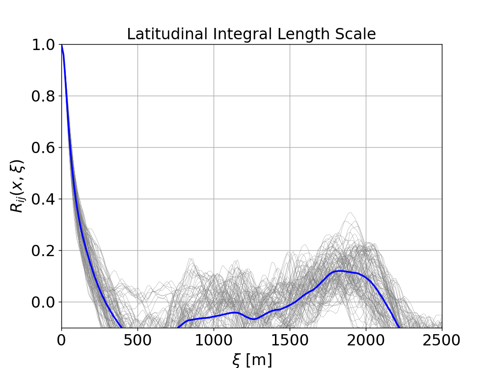

<!-- This file is automatically compiled into the website. Please copy linked files into .website_src/ paths to enable website rendering -->

# Convectively unstable ABL for wind turbine simulations

This benchmark problem is a slightly convective unstable atmospheric boundary
layer that is used as an inflow for the [actuator line
NREL5MW](../../actuator_line/NREL5MW_ALM_BD/) and geometry resolved NREL5MW
benchmark cases. The conditions and details of the case are summarized below:

- Hub-height wind speed: 11.4 m/s
- Hub-height wind direction: 240 degrees SW
- Surface roughness: 0.01 m
- Surface temperature flux: 0.005 K-m/s
- Domain size: 5120m x 5120m x 1920m 
- Mesh size: 512 x 512 x 192
- Total mesh size: 50331648 cells

**Contents**

- [Simulation setup](#simulation-setup)
- [Performance](#performance)
- [Results](#results)

## Simulation Setup

Full details of the simulation setup are provided in [**setup documentation**](setup/README.md).

The case was set up using the [AMR-Wind frontend](https://github.com/Exawind/amr-wind-frontend) with the notebook [convectiveABL_setup.ipynb](convective_abl_nrel5mw/setup/convectiveABL_setup.ipynb).  This allows the locations of the refinement regions and sampling planes to be setup properly relative to the location of the NREL5MW turbine.

Input files are in the [input_files](input_files) directory.  There are two stages to this run:

1. Spin-up of the precursor: Use the [convective_abl.inp](input_files/convective_abl.inp) input file to run the case from t=0 to 15,000 seconds.

2. Capture the boundary plane and sampling plane data: Use [convective_abl_bndry.inp](input_files/convective_abl_bndry.inp) to run the case from t=15,000 to 20,000 seconds to output the data needed to run the turbine cases.

Current case was run with AMR-Wind version [f67a52dd6aa1882595d16700527470bc8097cb13](https://github.com/Exawind/amr-wind/commit/f67a52dd6aa1882595d16700527470bc8097cb13)

## Performance

Full details provided in [**performance documentation**](performance/README.md).

The simulation was run on the Sandia Flight HPC cluster using the following resources: 

| Parameter       | Value |
|---              |---  |
| Number of nodes | 8   |
| Number of CPUs  | 896 |
| Wall-time       | 5.4 hours|
| CPU-hours       | 4821.7 |  


## Results

Statistics from the ABL are calculated over the time interval $t \in [15000 , 20000]s$ using scripts and notebooks from the [postprocessing](postprocessing) directory. The results are saved to the [results](results/) directory.  

Horizontally averaged statistics are computed in the
[AVG_horiz_profiles.ipynb](postprocessing/AVG_horiz_profiles.ipynb) notebook and
are summarized in the following table at the bottom-tip, hub-height, and top-tip
location of the NREL5MW:

| z | Horizontal Velocity | Wind Direction | TI (TKE) | Shear Exponent | Veer|
|--|--|--|--|--|--|
|27 m  | 9.89 m/s  | 239.74 deg | 8.29 % | 0.1300 | 0.0087 deg/m
|90 m  | 11.40 m/s  | 240.00 deg | 6.17 % | 0.0815 | 0.0006 deg/m
|153 m  | 11.90 m/s  | 240.02 deg | 5.38 % | 0.0693 | 0.0001 deg/m

The veer and shear exponent over the rotor disk are 0.0015 deg/m and 0.0944, respectively. The corresponding friction velocity, $u^*$, inversion height, $z_i$, and Obukhov length-scale for this simulation are:

 - $u^*$ = 0.468 m/s
 - $z_i$ = 803.133 m
 - Obukhov Length = -2447.446 m (computed at z=27 m)  


### Flow Visualizations

An instantaneous hub-height visualization of the horizontal velocity at $t=15,000$s is included below. 


### Horizontal Profiles

Horizontally averaged profiles are computed in the [AVG_horiz_profiles.ipynb](postprocessing/AVG_horiz_profiles.ipynb) Jupyter notebook are shown below. 

**Note**: The python routines for computing horizontal profiles from the statistics file(s) generated by AMR-Wind rely on importing the [postproamrwindabl](https://github.com/Exawind/amr-wind-frontend/blob/main/postproamrwindabl.py) module from the [AMR-Wind front end](https://github.com/Exawind/amr-wind-frontend) library. It is not necessary to import the entire AMR-Wind front end library to compute the horizontal profiles.  If necessary, download the module files and edit the lines in the python code which define `postproamrwinddir` to include the location of that module:
```python
# Location of postproamrwindabl module inside the amr-wind-frontend
postproamrwinddir = '~/src/amr-wind-frontend/'
import sys, os, shutil, io
if postproamrwinddir not in sys.path:
    sys.path.append(postproamrwinddir)
```

#### Horizontal velocity:


#### Temperature:


#### Wind Direction:


#### Turbulence Intensity (TKE):


#### Resolved Reynolds stresses:


#### Resolved Temperature Fluxes:


### Metmast Profiles

Averaged wind profiles from a virtual metmast at the turbine location are computed in the [AVG_metmast.ipynb](postprocessing/AVG_metmast.ipynb) Jupyter notebook and are shown below.



**Note**: The path to the [AMR-Wind front end](https://github.com/Exawind/amr-wind-frontend) library must be provided in the [ABL_metmast.ipynb](postprocessing/ABL_metmast.ipynb) Jupyter notebook.  If necessary, download the library and edit the lines which define `amrwindfedirs` to include any locations of that library, e.g.,
```python
# Add any possible locations of amr-wind-frontend here
amrwindfedirs = ['/projects/wind_uq/lcheung/amrwind-frontend/',
                 '/ccs/proj/cfd162/lcheung/amrwind-frontend/']
import sys, os, shutil, io
for x in amrwindfedirs: sys.path.insert(1, x)
```

### Wavenumber Spectra

Two-dimensional (2D) wavenumber spectra are computed from the XY planes sampled from AMR-Wind using the [post-processing engine](https://github.com/Exawind/amr-wind-frontend/tree/main/postproengine) in the the [AMR-Wind front end](https://github.com/Exawind/amr-wind-frontend) library. The [yaml file](/postprocessing/postpro_windspectra_CGrid.yaml) for computing 2D wavenumber spectra of vertical planes sampled in this benchmark case can be called using the [ppengine.py](https://github.com/Exawind/amr-wind-frontend/blob/main/utilities/ppengine.py) utility as
```
python ppengine.py postpro_windspectra.yaml
```
Details of the 2D wavenumber computation can be found in the [documentation](edit) for the post-processing engine.
The [ABL_wavenumber_spectra.ipynb](postprocessing/ABL_wavenumber_spectra.ipynb) Jupyter notebook plots the energy, horizontal, and vertical 2D wavenumber spectra and are reported below at the bottom-tip and hub-height locations of the NREL5MW: 



### Temporal Spectra

Temporal spectra are computed from the XY planes sampled from AMR-Wind using the [post-processing engine](https://github.com/Exawind/amr-wind-frontend/tree/main/postproengine) in the [AMR-Wind front end](https://github.com/Exawind/amr-wind-frontend) library. The [ABL_temporal_spectra.ipynb](postprocessing/ABL_temporal_spectra.ipynb) Jupyter notebook can be used to compute the temporal spectra and to plot the results against a Kaimal spectra. 
Details of the temporal spectra computation can be found in the [documentation](https://github.com/Exawind/amr-wind-frontend/tree/main/postproengine/doc) for the post-processing engine. 

**Note**: The path to the [AMR-Wind front end](https://github.com/Exawind/amr-wind-frontend) library must be provided in the [ABL_temporal_spectra.ipynb](postprocessing/ABL_temporal_spectra.ipynb) Jupyter notebook.  If necessary, download the library and edit the lines which define `amrwindfedirs` to include any locations of that library, e.g.,
```python
# Add any possible locations of amr-wind-frontend here
amrwindfedirs = ['/projects/wind_uq/lcheung/amrwind-frontend/',
                 '/ccs/proj/cfd162/lcheung/amrwind-frontend/']
import sys, os, shutil, io
for x in amrwindfedirs: sys.path.insert(1, x)
```
The streamwise, lateral, and vertical temporal spectra sampled from XY planes at the bottom-tip and hub-height locations of the NREL5MW are reported below:

#### z = 27m


#### z = 90m


### Integral Length scale 

The longitudinal and latitudinal integral length scales are computed in the [ABL_integral_lengthscale.ipynb](postprocessing/ABL_integral_lengthscale.ipynb) notebook, resulting in 

- Longitudinal length scale >= 609.21 m 
- Latitudinal length scale  = 95.29 m

The computation of the integral length scale relies on the [AMR-Wind front end](https://github.com/Exawind/amr-wind-frontend) library to compute the two-point correlation. 

**Note**: The path to the [AMR-Wind front end](https://github.com/Exawind/amr-wind-frontend) library and the AMR-Wind front end [utilities](https://github.com/Exawind/amr-wind-frontend/tree/main/utilities) must be provided in the [ABL_integral_lengthscale.ipynb](postprocessing/ABL_integral_lengthscale.ipynb) notebook. If necessary, download the library and edit the lines which define `amrwindfedirs` to include any locations of that library, e.g.,
```python
# Add any possible locations of amr-wind-frontend here
amrwindfedirs = ['/projects/wind_uq/lcheung/amrwind-frontend/',
                 '/ccs/proj/cfd162/lcheung/amrwind-frontend/']
import sys, os, shutil
for x in amrwindfedirs: sys.path.insert(1, x)
for x in amrwindfedirs: sys.path.insert(1, x+'/utilities')  
```
The two-point correlation, $R_{ij}$, as a function of longitudinal and latitudinal separation distance $\boldsymbol{\xi}$ are shown below at multiple locations, $\boldsymbol{x}$, on the XY-plane at z=90m:



