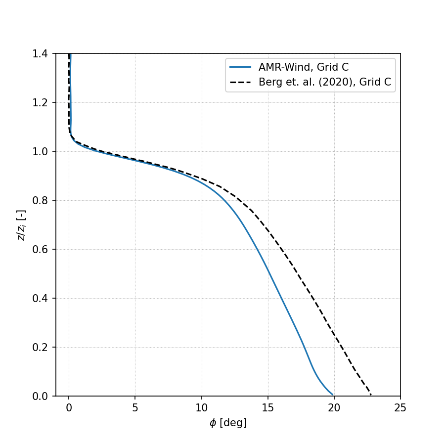
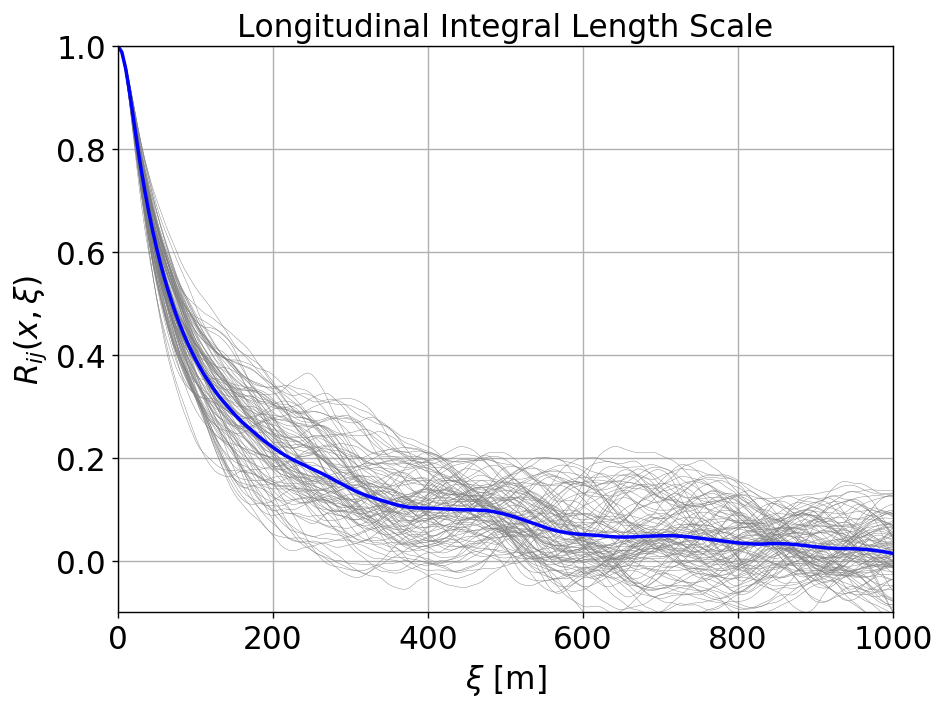
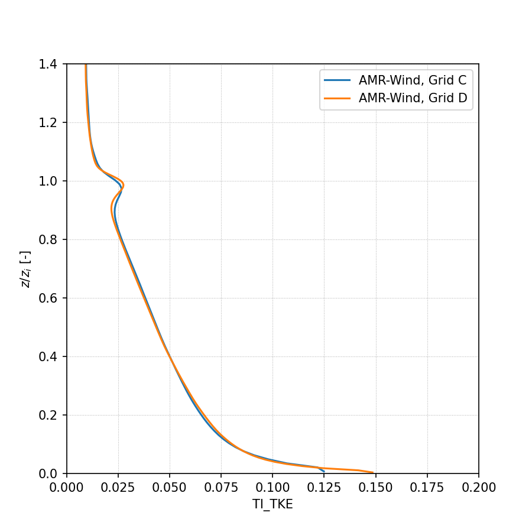
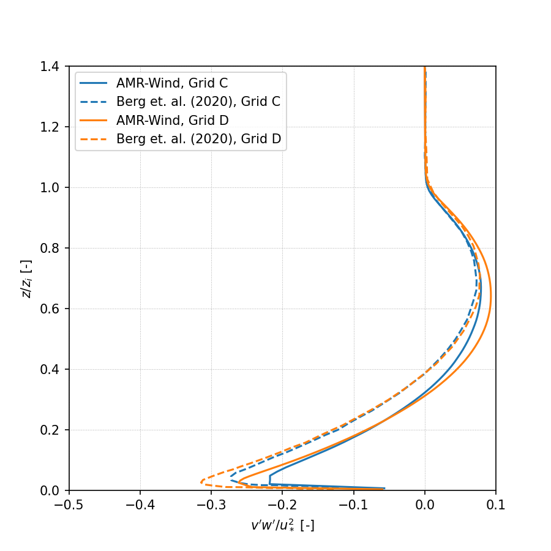
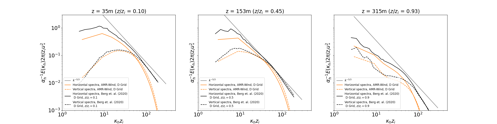

<!-- This file is automatically compiled into the website. Please copy linked files into .website_src/ paths to enable website rendering -->

# Neutral Atmospheric Boundary Layer 

This is a conventionally neutral stability case that was presented in Berg et
al. (2020). The flow is driven by a uniform, moderate geostrophic wind of 5 m/s,
aligned in the x-direction. There is no specified heat flux at the surface. This
case starts out weakly stably stratified and the turbulence naturally present
evolves the flow to create a neutral layer with a capping inversion. The flow is
dominated by streaks of high and low velocities near the surface and at heights
typical for wind turbine rotors. The domain spatial size is 2560 m × 2560 m ×
896 m. Berg et al. (2020) used resolutions ranging from ∆x = ∆y = 30 m and ∆z =
14 m to ∆x = ∆y = 3.75 m and ∆z = 1.75 m. The benchmark simulation in AMR-Wind 
use ∆x = ∆y = 5 m and ∆z = 4.87 m (512 × 512 × 184 cells), corresponding the horizontal
resolution in the "C-grid" used in Berg et al (2020). 

The input files for this case are in the [input_files](input_files) directory. The computation was done on kestrel, using 20 CPU nodes for 144 hours, with the latest release of AMR-Wind [f67a52dd6aa1882595d16700527470bc8097cb13](https://github.com/Exawind/amr-wind/commit/f67a52dd6aa1882595d16700527470bc8097cb13) (update this). Several input parameters for this case are summarized below: 

- Hub-height wind speed: 5.0 m/s
- Hub-height wind direction: 250 degrees W
- Surface roughness: 0.05 m
- Surface temperature flux: 0.0 K-m/s
- Reference temperature: 290 K 
- Domain size: 5120m x 5120m x 1920m 
- Mesh size: 512 x 512 x 184 (C-Grid)
- Total mesh size: 48234496 cells
- Timestep: ∆t = 0.5s
- Total simulation time: 125000s

## Results

Statistics and results from the ABL are calculated using the scripts and notebooks in the [postprocessing](postprocessing) directory, and are saved to the [results](directory) directory. Statistics from the hub-height plane are computed in [AVG_horiz_profiles.ipynb](postprocessing/AVG_horiz_profiles.ipynb) notebook and are summarized in the following table: 

| z | Horizontal Velocity | Wind Direction | TI (TKE) | Shear Exponent | ObukhovL | Veer | zi | u* |
|--|--|--|--|--|--|--|--|--|
| 90m | 4.39m/s | 252.7 deg | 0.0603 | 0.1465 | 729.8625 | 0.0237 | 352.06 | 0.208

The statistics are averaged over the time interval t=[120000,125000]s. Defining the eddy turnover time as T=zi/u*, this time interval corresponds to t/TE = [72.5,75.5], which is used to compute all of the results discussed herein. It is important to note that 75 eddy turnover times is exceed the 55 eddy turnover times needed for statistical convergence, as identified by Berg et al. (2020). However, while Berg et al. (2020) averaged their results over 10 eddy turnover times (t/TE=[55,54]) the ARM-Wind results are averaged over 3 eddy turnover times. This distinction should be considered in the subsequent comparisons. 

### Horizontal Profiles

Horizontal velocity profiles are computed in the [AVG_horiz_profiles.ipynb](postprocessing/AVG_horiz_profiles.ipynb) notebook and are shown below: 

- Horizontal velocity:

- Temperature: 

- Wind Direction: 

- Turbulence Intensity (TKE): 

- Wind Shear: 

- Resolved Reynolds stress, avg(u'w'): 

- Resolved Reynolds stress, avg(v'w'): 

### Wavenumber Spectra

Wavenumber spectra are computed in the [ABL_wavenumber_spectra.ipynb](postprocessing/ABL_wavenumber_spectra.ipynb) notebook and are reported below. Specifically, the Fourier transform of the two-point velocity correlation $R_{ij}(\boldsymbol{r},t) = \langle u_i(\boldsymbol{x},t) u_j(\boldsymbol{x}+\boldsymbol{r},t) \rangle$ is computed from the FFT of the sampled AMR-Wind velocity data at a given height, $z$, as 
$$
\hat{R}_{ij}(\boldsymbol{r},t) = \langle \hat{u}^*_i(\boldsymbol{\kappa},t) \hat{u}_j(\boldsymbol{\kappa},t) \rangle 
.
$$
Here, $\boldsymbol{x} = (x,y)$ is a 2D horizontal vector, and $\boldsymbol{r} = (r_x,r_y)$ is a 2D separation vector. 
The velocity spectrum tensor, $\Phi_{ij}(\boldsymbol{\kappa},t)$, for a 2D wavenumber vector $\boldsymbol{\kappa} = (\kappa_x,\kappa_y)$, is then computed as 
$$
\Phi_{ij}(\boldsymbol{\kappa},t) \equiv \sum_{\boldsymbol{\kappa'}} \delta(\boldsymbol{\kappa} - \boldsymbol{\kappa}') \hat{R}_{ij}(\boldsymbol{\kappa}',t) \approx \hat{R}_{ij}(\boldsymbol{\kappa},t)/(\Delta \boldsymbol{\kappa}),
$$
such that
$$
R_{ij}(\boldsymbol{r},t) = \iint \Phi_{ij}(\boldsymbol{\kappa},t) e^{i \boldsymbol{\kappa} \cdot \boldsymbol{r}} d \boldsymbol{\kappa}.
$$
The two dimensional spectra are then computed as surface integrals in 2D wavenumber space. Specifically, we denote the circle in wavenumber space, centered at the origin, with radius $\kappa = |\boldsymbol{\kappa}|$ as $\mathcal{S}(\kappa)$. Then the integration over the surface of this circle is approximated as 
$$
\oint f(\boldsymbol{\kappa}) d \mathcal{S}(\kappa) \approx 
\frac{2 \pi \kappa}{N} \sum^N_{ |\kappa' - \kappa| < d\kappa } f(\boldsymbol{\kappa}') 
,
$$
where $N$ is the total number of points in the summation for each wavenumber magnitude. 
This is applied to different components of the velocity spectrum tensor to compute the energy, horizontal, and vertical spectra as:

- Energy spectra: 
$$ 
E = \oint  \frac{1}{2} \Phi_{ii}(\boldsymbol{\kappa},t) d\mathcal{S}(\kappa)
$$
- Horizontal spectra:
$$ 
E = \oint  \frac{1}{2} \left[ \Phi_{11}(\boldsymbol{\kappa},t) + \Phi_{22}(\boldsymbol{\kappa},t)  \right] d\mathcal{S}(\kappa)
$$

- Vertical spectra:
$$ 
E = \oint \Phi_{33}(\boldsymbol{\kappa},t) d\mathcal{S}(\kappa)
$$

### Temporal Spectra

Temporal spectra are computed in the [ABL_temporal_spectra.ipynb](postprocessing/ABL_temporal_spectra.ipynb) notebook and are shown below. 

TODO: Add expression

### Integral Lengthscale 

The longitudinal and latitudinal integral lengthscales in the [ABL_integral_lengthscale.ipynb](postprocessing/ABL_integral_lengthscale.ipynb) notebook, resulting in 

- Longitudinal lengthscale = 154.94 m 
- Latitudinal lengthscale  = 34.03 m 

TODO: Add expression

## Grid Refinement Study

A grid refinement study is included with this benchmarking case to document the impact of mesh resolution on the neutral ABL statistics in AMR-Wind. The mesh resolution in each direction are doubled, leading to a mesh side of 1024 x 1024 x 368 or 385875968a total cells. The horizontal resolution in this case corresponds to the "D-grid" in Berg et al. (2020), which are included in the comparisons below. The input file for the refined-resolution case is found in [input_files/abl_neutral_D_grid.inp](input_files/abl_neutral_D_grid.inp).

## Results

The refined-resolution case is also evolved for 125000s, and statistics are averaged over the time interval t=[120000,125000]. The hub-height statistics for this case are 

| z | Horizontal Velocity | Wind Direction | TI (TKE) | Shear Exponent | ObukhovL | Veer | zi | u* |
|--|--|--|--|--|--|--|--|--|
| 90m | 4.36m/s | 252.2 deg | 0.0603 | 0.1678 | 754.4361 | 0.0368 | 337.04 | 0.203

### Horizontal Profiles

Horizontal velocity profiles are computed in the [AVG_horiz_profiles.ipynb](postprocessing/AVG_horiz_profiles.ipynb) notebook and are shown below: 

- Horizontal velocity:

- Temperature: 

- Wind Direction: 

- Turbulence Intensity (TKE): 

- Wind Shear: 

- Resolved Reynolds stress, avg(u'w'): 

- Resolved Reynolds stress, avg(v'w'): 

### Wavenumber Spectra

Wavenumber spectra are computed in the [ABL_wavenumber_spectra.ipynb](postprocessing/ABL_wavenumber_spectra.ipynb) notebook and are shown below. 

TODO: Add expression

### Temporal Spectra

Temporal spectra are computed in the [ABL_temporal_spectra.ipynb](postprocessing/ABL_temporal_spectra.ipynb) notebook and are shown below. 

TODO: Add expression

