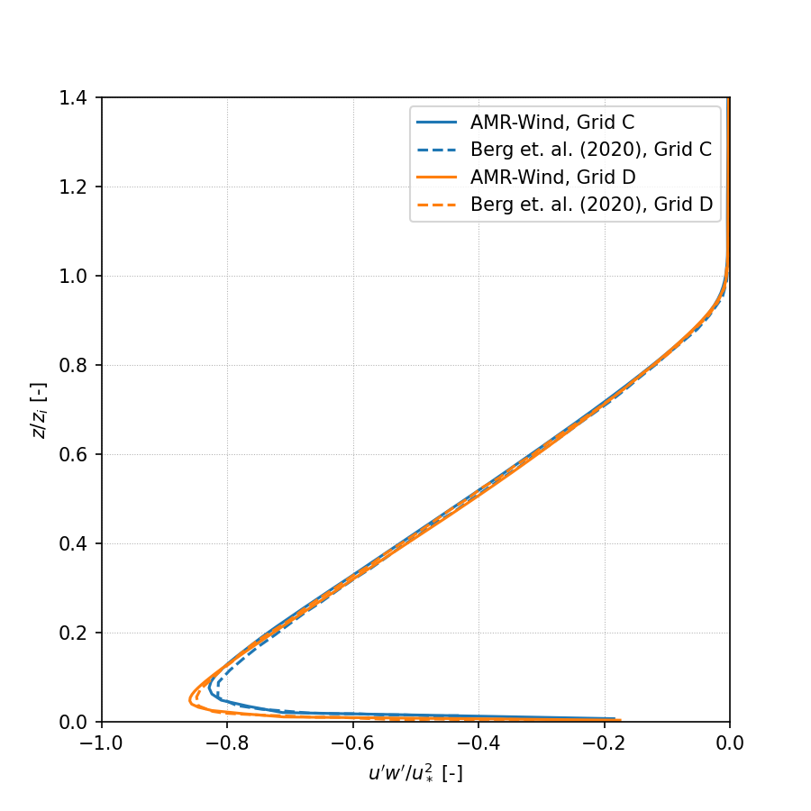

<!-- This file is automatically compiled into the website. Please copy linked files into .website_src/ paths to enable website rendering -->

# Neutral Atmospheric Boundary Layer 

This benchmark problem is a conventionally neutral atmospheric boundary layer
(ABL) and corresponds to the case presented in Berg et al. (2020). The flow is
driven by a uniform, moderate geostrophic wind of 5 m/s, aligned in the
x-direction. There is no specified heat flux at the surface. This case starts
out weakly stably stratified and the turbulence naturally present evolves the
flow to create a neutral layer with a capping inversion. The flow is dominated
by streaks of high and low velocities near the surface and at heights typical
for wind turbine rotors. The domain spatial size is 2560 m × 2560 m × 896 m.
Berg et al. (2020) used resolutions ranging from ∆x = ∆y = 30 m and ∆z = 14 m
to ∆x = ∆y = 3.75 m and ∆z = 1.75 m. The benchmark simulation in AMR-Wind uses
∆x = ∆y = 5 m and ∆z = 4.87 m (512 × 512 × 184 cells), corresponding the
horizontal resolution in the "C-grid" used in Berg et al (2020). 

**Contents**

- [Simulation setup](#simulation-setup)
- [Performance](#performance)
- [Results](#results)

## Simulation Setup

Full details of the simulation setup are provided in [**setup documentation**](input_files/README.md).

The input files for this case are located in the [input_files](input_files) directory. Several of the main input parameters for this case are summarized below: 

- Hub-height wind speed: 5.0 m/s
- Hub-height wind direction: 250 degrees W
- Surface roughness: 0.05 m
- Surface temperature flux: 0.0 K-m/s
- Reference temperature: 290 K 
- Domain size: 5120m x 5120m x 1920m 
- Mesh size: 512 x 512 x 184 (C-Grid)
- Total mesh size: 48234496 cells
- Timestep: ∆t = 0.5s
- Total simulation time: 125000s

## Performance

Full details provided in [**performance documentation**](performance/README.md).

The simulation was run on the NREL's [Kestrel](https://nrel.github.io/HPC/Documentation/Systems/) HPC cluster using 20 nodes/2080 CPU's and run for 144 hours wall-time:

| Parameter       | Value |
|---              |---  |
| Number of nodes | 20   |
| Number of CPUs  | 2080 |
| Wall-time       | 144 hours|
| CPU-hours       | 299520     |

## Results

Statistics and results from the ABL are calculated using the scripts and notebooks in the [postprocessing](postprocessing) directory, and are saved to the [results](directory) directory. Statistics from the hub-height plane are computed in the [AVG_horiz_profiles.ipynb](postprocessing/AVG_horiz_profiles.ipynb) notebook and are summarized in the following table: 

| z | Horizontal Velocity | Wind Direction | TI (TKE) | Shear Exponent | ObukhovL | Veer | $z_i$ | $u^*$ |
|--|--|--|--|--|--|--|--|--|
| 90m | 4.39m/s | 252.7 deg | 0.0603 | 0.1465 | 729.8625 | 0.0237 | 352.06 | 0.208

The statistics are averaged over the time interval $t\in[120000,125000]s$. Defining the eddy turnover time as $TE=z_i/u^*$, this time interval corresponds to $t/TE \in [72.5,75.5]$, which is used to compute all of the results discussed herein. It is important to note that 75 eddy turnover times exceed the 55 eddy turnover times needed for statistical convergence, as identified by Berg et al. (2020). However, while Berg et al. (2020) averaged their results over 10 eddy turnover times ($t/TE=[55,65]$) the ARM-Wind results are averaged over 3 eddy turnover times. This distinction should be considered in the subsequent comparisons. 

### Horizontal Profiles
-----------------------

Horizontally averaged profiles of are computed in the [AVG_horiz_profiles.ipynb](postprocessing/AVG_horiz_profiles.ipynb) Jupyter notebook and python code are shown below. 

**Note**: The python routines for computing horizontal profiles from the statistics file(s) generated by AMR-Wind rely on importing the [postproamrwindabl](https://github.com/Exawind/amr-wind-frontend/blob/main/postproamrwindabl.py) module from the [AMR-Wind frontend](https://github.com/Exawind/amr-wind-frontend) library. It is not necessary to import the entire ARM-Wind frontend library to compute the horizontal profiles.  If necessary, download the module files and edit the lines in the python code which define `postproamrwinddir` to include the location of that module:
```python
# Location of postproamrwindabl module inside the amr-wind-frontend
postproamrwinddir = '~/src/amr-wind-frontend/'
import sys, os, shutil, io
if postproamrwinddir not in sys.path:
    sys.path.append(postproamrwinddir)
```

#### Horizontal velocity:


#### Temperature:


#### Wind Direction:


#### Turbulence Intensity (TKE):


#### Wind Shear:


#### Resolved Reynolds stress, avg(u'w'):


#### Resolved Reynolds stress, avg(v'w'):


### Wavenumber Spectra
-----------------------

Two-dimensional (2D) wavenumber spectra are computed from the XY planes sampled from AMR-Wind using the [post-processing engine](https://github.com/Exawind/amr-wind-frontend/tree/main/postproengine) in the the [AMR-Wind frontend](https://github.com/Exawind/amr-wind-frontend) library. The [yaml file](/postprocessing/postpro_windspectra_CGrid.yaml) for computing 2D wavenumber spectra of vertical planes sampled in this benchmark case can be called using the [ppengine.py](https://github.com/Exawind/amr-wind-frontend/blob/main/utilities/ppengine.py) utility as
```
python ppengine.py postpro_windspectra_CGrid.yaml
```
Details of the 2D wavenumber computation can be found in the [documentation](edit) for the post-processing engine.
The [ABL_wavenumber_spectra.ipynb](postprocessing/ABL_wavenumber_spectra.ipynb) Jupyter notebook plots the energy, horizontal, and vertical 2D wavenumber spectra and are reported below at three different vertical locations in the domain. 


### Temporal Spectra
-----------------------

Temporal spectra are computed from the XY planes sampled from AMR-Wind using the [post-processing engine](https://github.com/Exawind/amr-wind-frontend/tree/main/postproengine) in the [AMR-Wind frontend](https://github.com/Exawind/amr-wind-frontend) library. The [ABL_temporal_spectra.ipynb](postprocessing/ABL_temporal_spectra.ipynb) jupyter notebook can be used to compute the temporal spectra and to plot the results against a Kaimal spectra. 
Details of the temporal spectra computation can be found in the [documentation](edit) for the post-processing engine. 

**Note**: The path to the [AMR-Wind frontend](https://github.com/Exawind/amr-wind-frontend) library must be provided in the [ABL_temporal_spectra.ipynb](postprocessing/ABL_temporal_spectra.ipynb) jupyter notebook  If necessary, download the library and edit the lines which define `amrwindfedirs` to include any locations of that library, e.g.,
```python
# Add any possible locations of amr-wind-frontend here
amrwindfedirs = ['/projects/wind_uq/lcheung/amrwind-frontend/',
                 '/ccs/proj/cfd162/lcheung/amrwind-frontend/']
import sys, os, shutil, io
for x in amrwindfedirs: sys.path.insert(1, x)
```
The streamwise, lateral, and vertical temporal spectra sampled from XY planes at two different vertical locations are reported below:

#### z = 27m

#### z = 90m


### Integral Lengthscale 

The longitudinal and latitudinal integral lengthscales are computed in the [ABL_integral_lengthscale.ipynb](postprocessing/ABL_integral_lengthscale.ipynb) notebook, resulting in 

- Longitudinal lengthscale = 154.94 m 
- Latitudinal lengthscale  = 34.03 m 

The computation of the integral lengthscale relies on the [AMR-Wind frontend](https://github.com/Exawind/amr-wind-frontend) library to compute the two-point correlation. 

**Note**: The path to the [AMR-Wind frontend](https://github.com/Exawind/amr-wind-frontend) library and the AMR-Wind frontend [utilities](https://github.com/Exawind/amr-wind-frontend/tree/main/utilities) must be provided in the [ABL_integral_lengthscale.ipynb](postprocessing/ABL_integral_lengthscale.ipynb) notebook. If necessary, download the library and edit the lines which define `amrwindfedirs` to include any locations of that library, e.g.,
```python
# Add any possible locations of amr-wind-frontend here
amrwindfedirs = ['/projects/wind_uq/lcheung/amrwind-frontend/',
                 '/ccs/proj/cfd162/lcheung/amrwind-frontend/']
import sys, os, shutil
for x in amrwindfedirs: sys.path.insert(1, x)
for x in amrwindfedirs: sys.path.insert(1, x+'/utilities')  
```
The two-point correlation, $R_{ij}$, as a function of longitudinal and latitudinal separation distance $\boldsymbol{\xi}$ are shown below at multiple locations, $\boldsymbol{x}$, on the hub-height plane:


## Grid Refinement Study

A grid refinement study is included with this benchmarking case to document the impact of mesh resolution on the neutral ABL statistics in AMR-Wind. The mesh resolution in each direction is doubled, leading to a mesh side of 1024 x 1024 x 368 or 385875968 total cells. The horizontal resolution in this case corresponds to the "D-grid" in Berg et al. (2020), which are included in the comparisons below. The input file for the refined-resolution case is found in [input_files/abl_neutral_D_grid.inp](input_files/abl_neutral_D_grid.inp).

## Performance

Full details provided in [**performance documentation**](performance/README.md).

The grid refinement study was run on the Sandia Flight HPC cluster using the following resources: 

| Parameter       | Value |
|---              |---  |
| Number of nodes | 64   |
| Number of CPUs  | 7168 |
| Wall-time       | 177.68 hours|
| CPU-hours       | 1273610.24 | 

## Results

The refined-resolution case is also evolved for 125000s, and statistics are averaged over the time interval $t\in[120000,125000]s$. The hub-height statistics for this case are 

| z | Horizontal Velocity | Wind Direction | TI (TKE) | Shear Exponent | ObukhovL | Veer | $z_i$ | $u^*$ |
|--|--|--|--|--|--|--|--|--|
| 90m | 4.36m/s | 252.2 deg | 0.0603 | 0.1678 | 754.4361 | 0.0368 | 337.04 | 0.203

The instructions for computing statistics from the AMR-Wind sampling planes are identical those reported above, the results of which are reported in the following subsection.

### Horizontal Profiles
-----------------------

Horizontally averaged profiles of are computed in the [AVG_horiz_profiles.ipynb](postprocessing/AVG_horiz_profiles.ipynb) Jupyter notebook and are shown below. 

#### Horizontal velocity:


#### Temperature:


#### Wind Direction:


#### Turbulence Intensity (TKE):


#### Wind Shear:


#### Resolved Reynolds stress, avg(u'w'):


#### Resolved Reynolds stress, avg(v'w'):


### Wavenumber Spectra
-----------------------

Two-dimensional wavenumber spectra are computed in the [ABL_wavenumber_spectra.ipynb](postprocessing/ABL_wavenumber_spectra.ipynb) Jupyter notebook and are reported below at different vertical locations in the domain:


### Temporal Spectra
---------------------

Temporal spectra are computed in the [ABL_temporal_spectra.ipynb](postprocessing/ABL_temporal_spectra.ipynb) notebook and are reported below at two different vertical locations in the domain:


## References

For more information on the setup and comparisons presented in this benchmark, please see the following reference:

- Berg, J., E. G. Patton, and P. P. Sullivan, 2020: Large-Eddy Simulation of Conditionally Neutral Boundary Layers: A Mesh Resolution Sensitivity Study. J. Atmos. Sci., 77, 1969–1991, https://doi.org/10.1175/JAS-D-19-0252.1. 

