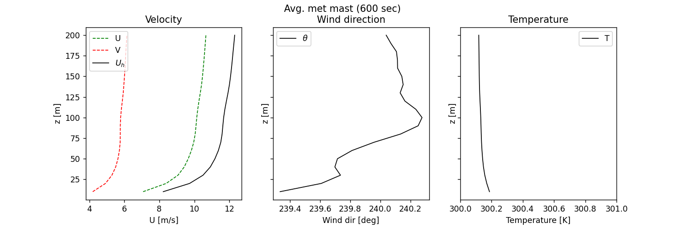
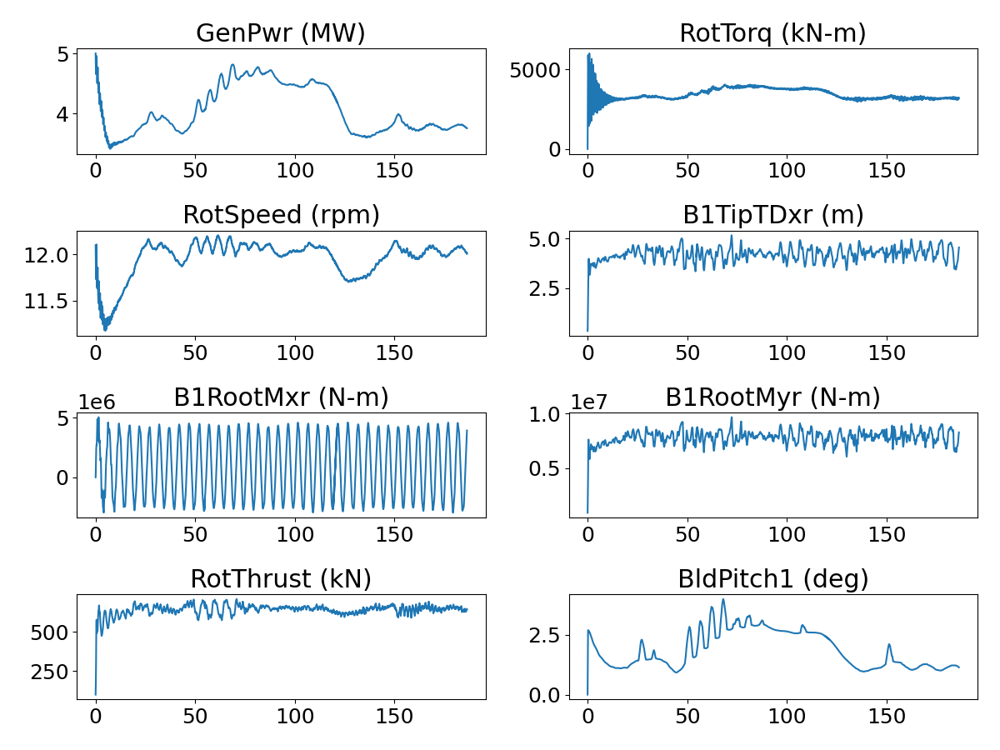

<!-- This file is automatically compiled into the website. Please copy linked files into .website_src/ paths to enable website rendering -->

# NREL 5MW Rotor in Atmospheric Boundary Layer With OpenFAST/BeamDyn Fluid Structure Interaction
This benchmark contains a geometry and boundary-layer resolved model of the NREL 5MW reference turbine [1] in a developed near-neutral convective atmospheric boundary layer with a mean hub-height streamwise velocity of 11.4m/s.

- Hub-height: 90m
- Blade Radius: 63m
- Rated Power: 5 MW
- Type: Upwind 3 Blade
- Simulation dt: 0.003443526170799 s
- OpenFAST dt: 0.0008608815426997245 s

<i>Note on run-time: Current results are for approximately 120s simulation time, but a minimum of 300s will be posted as results become available.</i>

## Simulation Setup
- ExaWind driver SHA: [cba5259fc43ddeca67329630d3c84faad90e91bb](https://github.com/Exawind/exawind-driver/commit/cba5259fc43ddeca67329630d3c84faad90e91bb)
- Nalu-Wind SHA: [b9e4ae654b646ecd0501dd6391dc7537239c82db](https://github.com/Exawind/nalu-wind/commit/b9e4ae654b646ecd0501dd6391dc7537239c82db)
- AMR-Wind SHA: [091b07fa3840af98925792290fb8788696290a5e](https://github.com/Exawind/amr-wind/commit/091b07fa3840af98925792290fb8788696290a5e)
- OpenFAST 4.0.2 SHA: [fc1110183bcc87b16d93129edabdce6d30e3a497](https://github.com/OpenFAST/openfast/commit/fc1110183bcc87b16d93129edabdce6d30e3a497)  

## Freestream Conditions
A near-neutral convective boundary layer precursor was run to feed the domain for this case. Full details are posted here: [Convective ABL for NREL5MW](../../../amr-wind/atmospheric_boundary_layer/convective_abl_nrel5mw/README.md)

10 minute flow statistics:
- Hub-height streamwise velocity: 11.4 m/s
- Hub-height flow direction: ~240.0 degrees

## CFD Mesh

**Total number of cells: 155,363,046**

The near-body (Nalu-Wind) mesh was created using a proprietary surface mesher, pyHyp, and Pointwise. Three blades are split at the hub, and an unconnected tower is included.
- Structured hex mesh
- Cell count: 13,436,646

Off-body (AMR-Wind) mesh was generated using the built-in capability of AMR-Wind. Off-body mesh information is summarized below 
- Mesh topology: Cartesian with AMR
- Domain in x= 0 to 5000m, y=0m to 5000m, z=0m to 1000m
- Initial grid size: 10m
- Finest cell size: 0.625m with 4 AMR levels
- Cell count: 141,926,400

## Results

#### Mean values over time period: 60s to 120s 

| variable | value |
| -------- | ------- |
|GenPwr|4551.89|
|GenTq|39.34|
|RotSpeed|12.07|
|RotThrust|647.96|
|B1RootMxr|770618.58|
|B1RootMyr|7875054.77|
|B1TipTDxr|4.20|
|BldPitch1|2.80|

## Simulation Timings

This benchmark was run at Sandia National Laboratories on a machine comprised of 112 Intel(R) Xeon(R) Platinum 8480+ CPU cores per node. 

### Processor Decomposition: 
- Nalu-Wind: 672 ranks
- AMR-Wind: 4928 ranks

### Timings:
- Mean wall-clock time per timestep for entire simulation: 17.75s 
- Mean wall-clock time per timestep per cell 1.142e-07s

## Exawind Simulation Guide
#### Step 1: Run the precursor for 5760 OpenFAST timesteps (approximately 1 rotation)
srun -n1 openfastcpp inp.yaml 
#### Step 2: Run the full Exawind suite
srun -N 50 -n 5600 exawind --nwind 672 --awind 4928 nrel5mw.yaml &> log
#### Step 3: Setup and Run the full Exawind suite restart(s)
srun -N 50 -n 5600 exawind --nwind 672 --awind 4928 nrel5mw_r1.yaml &> log_1

## References

[1]: Jonkman, J. et al, "Definition of a 5-MW Reference Wind Turbine for Offshore System Development" NREL/TP-500-38060, 2009. https://www.nrel.gov/docs/fy09osti/38060.pdf