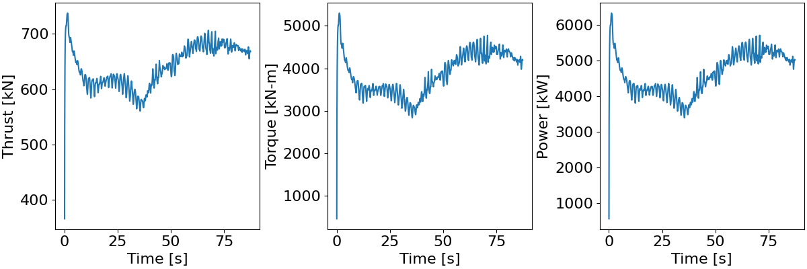

<!-- This file is automatically compiled into the website. Please copy linked files into .website_src/ paths to enable website rendering -->

# NREL 5MW Rotor in Atmospheric Boundary Layer With Rigid Bodies and Constant Rotation
This benchmark contains a geometry and boundary-layer resolved model of the NREL 5MW reference turbine [1] in a developed near-neutral convective atmospheric boundary layer with a mean hub-height streamwise velocity of 11.4m/s.

- Hub-height: 90m
- Blade Radius: 63m
- Rated Power: 5 MW
- Type: Upwind 3 Blade
- Simulation dt: 0.003443526170799 s
- OpenFAST dt: 0.0008608815426997245 s

<i>Note on run-time: Current results are for 125s simulation time, but by the time of benchmark release, a minimum of 360s will be posted.</i>

## Simulation Setup
- ExaWind driver SHA: [cba5259fc43ddeca67329630d3c84faad90e91bb](https://github.com/Exawind/exawind-driver/commit/cba5259fc43ddeca67329630d3c84faad90e91bb)
- Nalu-Wind SHA: [b9e4ae654b646ecd0501dd6391dc7537239c82db](https://github.com/Exawind/nalu-wind/commit/b9e4ae654b646ecd0501dd6391dc7537239c82db)
- AMR-Wind SHA: [091b07fa3840af98925792290fb8788696290a5e](https://github.com/Exawind/amr-wind/commit/091b07fa3840af98925792290fb8788696290a5e)

## Freestream Conditions
A near-neutral convective boundary layer precursor was run to feed the domain for this case. Full details are posted here: [Convective ABL for NREL5MW](../../../amr-wind/atmospheric_boundary_layer/convective_abl_nrel5mw/README.md)

10 minute flow statistics:
- Hub-height streamwise velocity: 11.4 m/s
- Hub-height flow direction: ~240.0 degrees

## CFD Mesh

**Total number of cells: 155,363,046**

The near-body (Nalu-Wind) mesh was created using a proprietary surface mesher, pyHyp, and Pointwise. Three blades are split at the hub, and an unconnected tower is included.
- Hexahedral cells
- Cell count: 13,436,646

Off-body (AMR-Wind) mesh was generated using the built-in capability of AMR-Wind. Off-body mesh information is summarized below 
- Mesh topology: structured hex with nested refinements
- Domain in x= 0 to 5000m, y=0m to 5000m, z=0m to 1000m
- Initial grid size: 10m
- Finest cell size: 0.625m with 4 AMR levels
- Cell count: 141,926,400

## Results

#### Postprocessing Procedure

Pressure and viscous force vectors are read at all blade surface faces. The integrated values, as well as moments around the hub, are recorded every four timesteps. 

Yaw angle: $\phi=30.0 \degree\\$
Tilt angle: $\psi=5.0 \degree\\$
Generator Efficiency: $E_g = 0.944\\$
Rotor Speed: $\Omega = 12.1 rpm$

$ f_x = f_{p_x}+f_{v_x}\\$
$ f_y = f_{p_y}+f_{v_y}\\$
$ f_z = f_{p_z}+f_{v_z}\\$

$ f_{\phi x} = f_x*cos(-\phi)-f_y*sin(-\phi)\\$
$ f_{\phi y} = f_x*sin(-\phi)+f_y*cos(-\phi)\\$
$ f_{\phi z} = f_z\\$

$ m_{\phi x} = m_x*cos(-\phi)-m_y*sin(-\phi)\\$
$ m_{\phi y} = m_x*sin(-\phi)+m_y*cos(-\phi)\\$
$ m_{\phi z} = m_z\\$

$ Torque = m_{\phi x}*cos(-\psi)+m_{\phi z}*sin(-\psi)\\$
$ Thrust =f_{\phi x}*cos(-\psi)+f_{\phi z}*sin(-\psi)\\$
$ Power = Torque*\Omega*E_g/1000\\$

| variable | value |
| -------- | ------- |
|Generator Power|4756.45 kW|
|Rotor Torque|3976.46 kN-m|
|Rotor Thrust|650.25 kN|
|Rotor Speed|12.1 rpm|

## Simulation Timings

This benchmark was run at Sandia National Laboratories on a machine comprised of 112 Intel(R) Xeon(R) Platinum 8480+ CPU cores per node. 

### Processor Decomposition: 
- Nalu-Wind: 672 ranks
- AMR-Wind: 4928 ranks

### Timings:
- Mean wall-clock time per timestep for entire simulation: 7.35s 
- Mean wall-clock time per timestep per cell 4.135e-08s

## Quick Exawind Simulation Guide
### Step 0: Run the ABL precursor in AMR-Wind
This simulation is driven by an ABL precursor, run in AMR-Wind, with recorded boundary planes, initial conditions, and average temperature. (See case linked above)
### Step 1: Develop and decompose overset mesh
It is necessary to develop a near-body mesh surrounding the blade surface in Nalu-Wind using external tools. This
mesh should be in the Exodus II format and decomposed to approximately 20K cells per core available to Nalu-Wind. (Current mesh provided via dvc/github assets) 
### Step 2: Run the OpenFAST precursor for 5760 OpenFAST timesteps (approximately 1 rotation)
``srun -n 1 openfastcpp iyaml``
### Step 3: Run the full Exawind suite
``srun -N 50 -n 5600 exawind --nwind 672 --awind 4928 nrel5mw.yaml &> log``
### Step 4: Setup and Run the full Exawind suite restart(s)
``srun -N 50 -n 5600 exawind --nwind 672 --awind 4928 nrel5mw_r1.yaml &> log_1``

## References

[1]: Jonkman, J. et al, "Definition of a 5-MW Reference Wind Turbine for Offshore System Development" NREL/TP-500-38060, 2009. https://www.nrel.gov/docs/fy09osti/38060.pdf